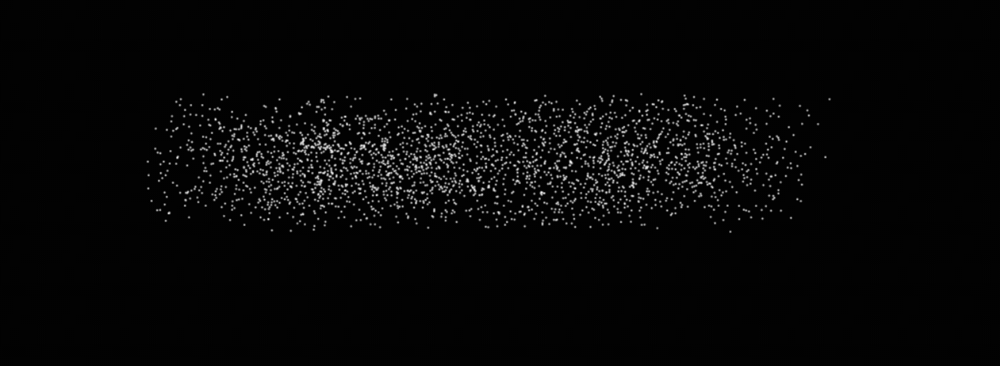

# Sand2Text

Interactive particle text morphing for HTML Canvas.

## Install
```bash
npm install sand2text
```

## Usage

```js
import Sand2Text from "sand2text";

const canvas = document.querySelector("#canvas");

const sand = new Sand2Text(canvas, 
    { //optional
    font: "80px Verdana",
    gap: 3,
    effect: "blink"
});

sand.setText("Hello");

setTimeout(()=>{
    sand2text.setText("World");
},3000)
```

